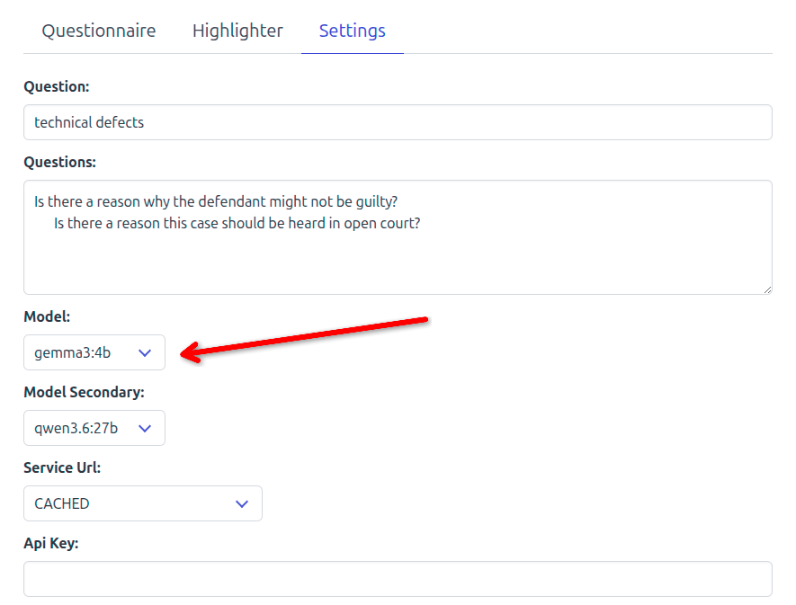
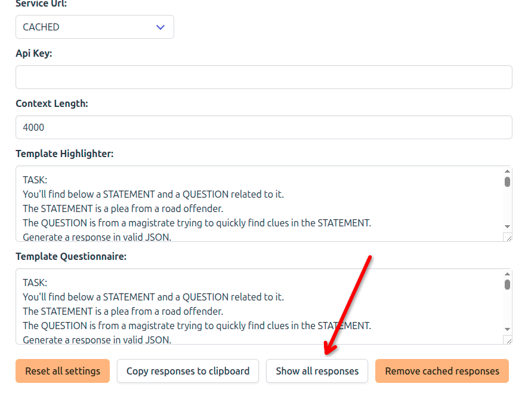
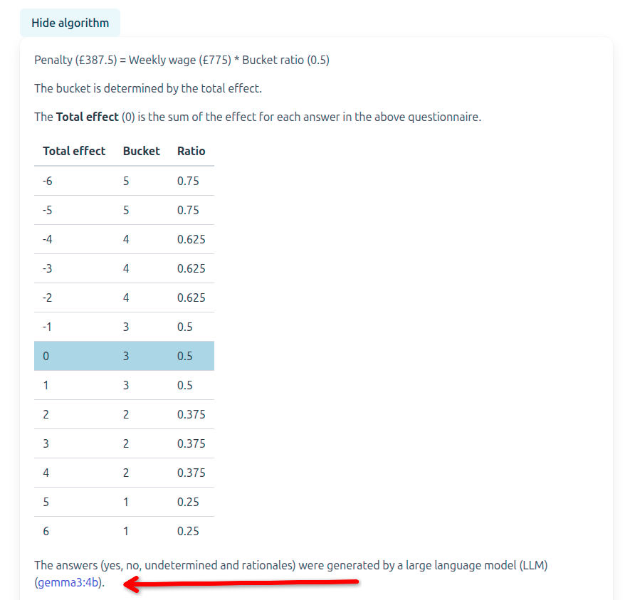
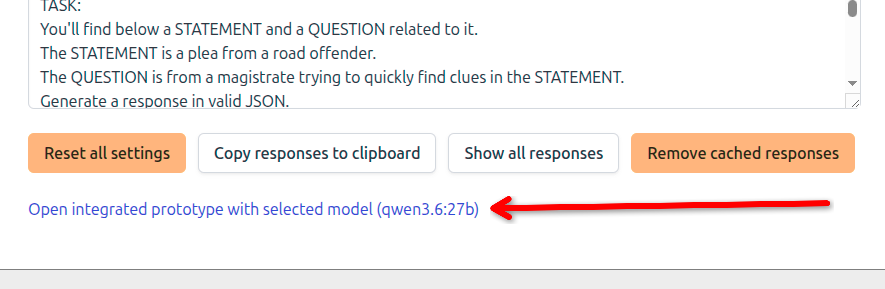

# How to change the large language model (LLM)

## On the Questionnaire and Highlighter

All the responses displayed on 
[the questionnaire and highlighter prototypes](https://kingsdigitallab.github.io/algorithmic-justice/nlpui.html) 
come from the same model selected in the Settings tab.

(You can ignore the "Secondary Model" dropdown on the settings page)

By default the drop down is set to a particular model 
(`gemma3:4b` in this example).

You can select alternative models in the drop down 
then return to the Questionnaire 
and click the "Ask" button next to each question to see the response.

To save you from clicking all the Ask button 
you can also pre-render all the responses at once 
after changing a model
by pressing the "Show all responses" button 
at the bottom of the Settings screen 
then return to the Questionnare tab.

Whenever you change a model 
its name is updated in the URL of the web page 
which is usually visible in the address bar of your browser.
You can therefore bookmark, copy and share that address 
and the next time it is opened, that model will be pre-selected.

## On the integrated prototype

Similarly all responses displayed on 
[the integrated prototype](https://kingsdigitallab.github.io/algorithmic-justice/poc3.html) 
come from one model. 

The model name is mentioned under the algorthm section. 
To get there, click "Explain algorithm" button under the question table.

There is no settings tab on this prototype 
because it is designed for end-users or tests.
An alternative model can be specified via the URL.

For instance, this URL [https://kingsdigitallab.github.io/algorithmic-justice/poc3.html?model=qwen3.6:27b](https://kingsdigitallab.github.io/algorithmic-justice/poc3.html?model=qwen3.6:27b) 
will select qwen3.6:27b and show its responses in the question table.

This allows you to share a link with other users or tester 
who will only see that particular model 
when the integrated prototype loads in their browser.

**Before sharing a link, please double check that it selects the desired model 
by opening it in your browser and verifying the name in the algorithm section**.

One way to obtain the link to the intergrated prototpye with the correct model
is to:
1. visit the Settings tab on the Questionnaire and Highlighter page,
2. select the desired model in the drop down
3. click the link at the bottom of the Settings tab

## Adding more models to the cache

Coming soon.
